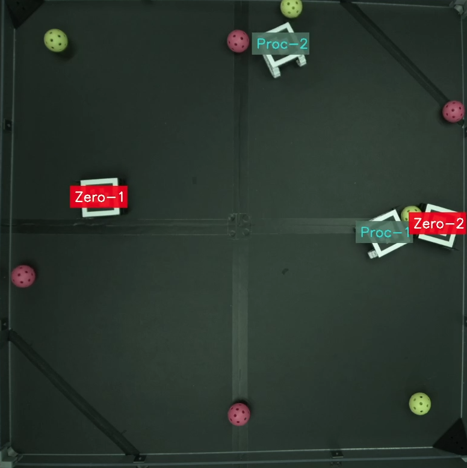

# Aruco marker tagger for video stream
This repo tags Aruco markers with text and box under the text.

See the params.yaml and edit colors, text and other values for each Aruco marker

# Linux
## Install
`chmod +x install.sh`

`./install.sh`

## Start
`chmod +x start.sh`

`./start.sh`

Stop program by pressing CTRL and C simuntaniously in the opened terminal window.

# Windows
## Install
`install.bat`

## Start
`start.bat`

Stop program by pressing CTRL and C simuntaniously in the opened terminal window.